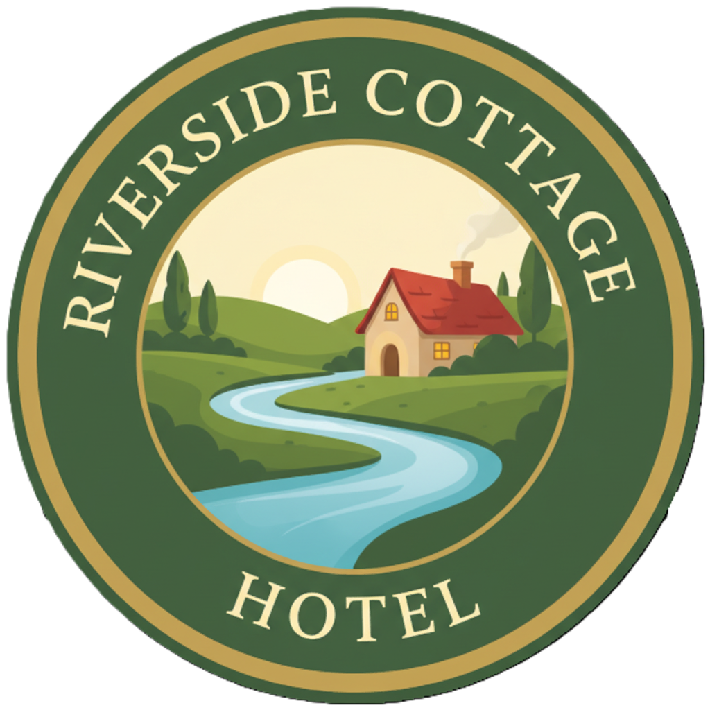
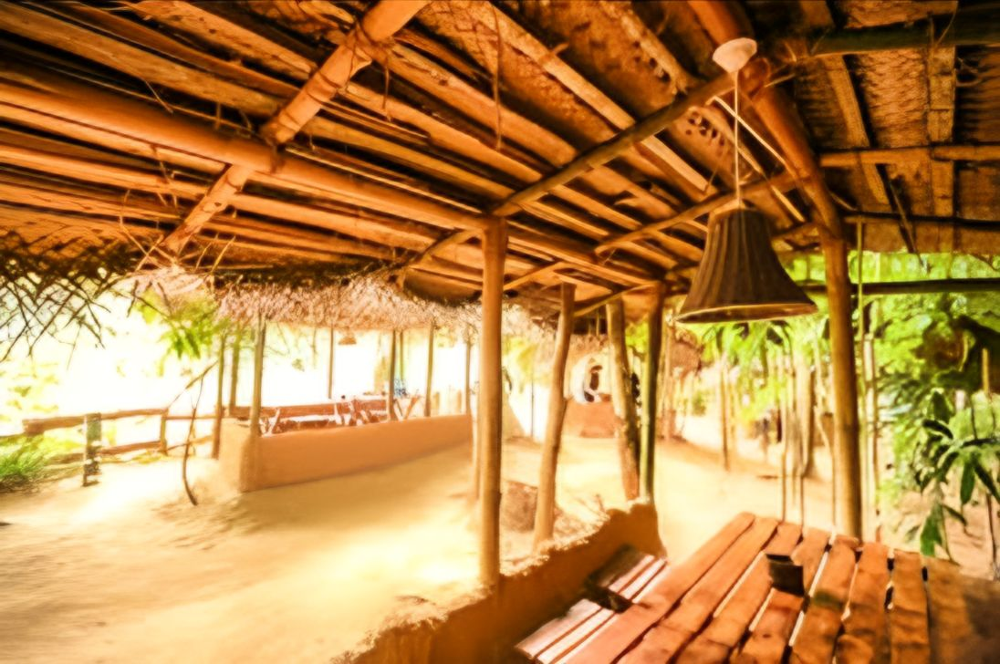
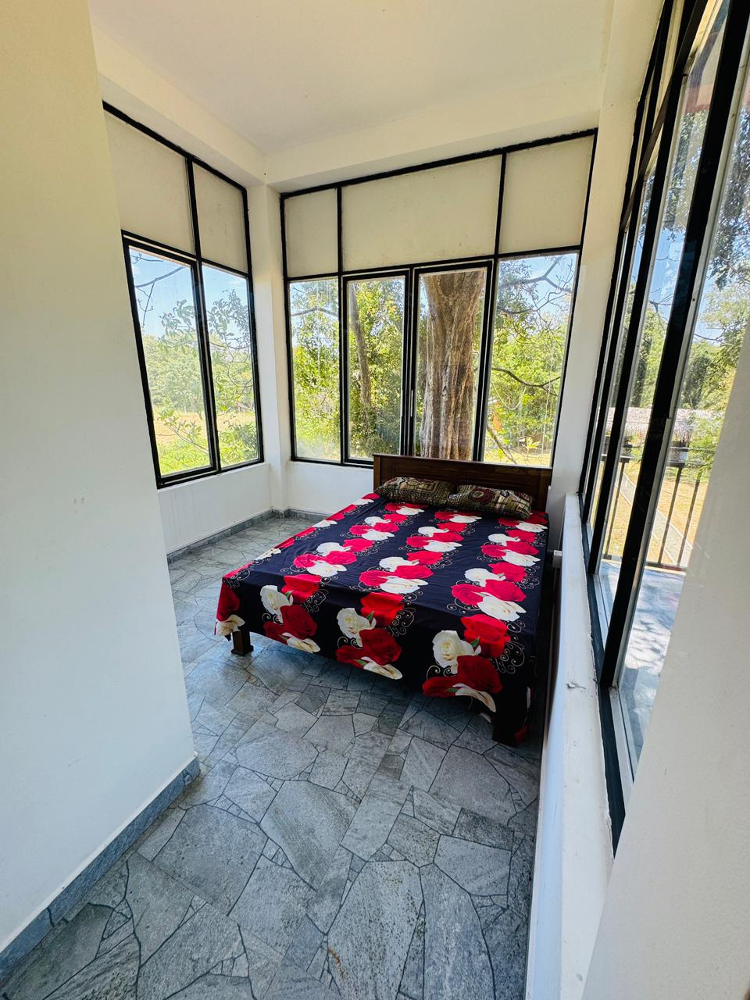
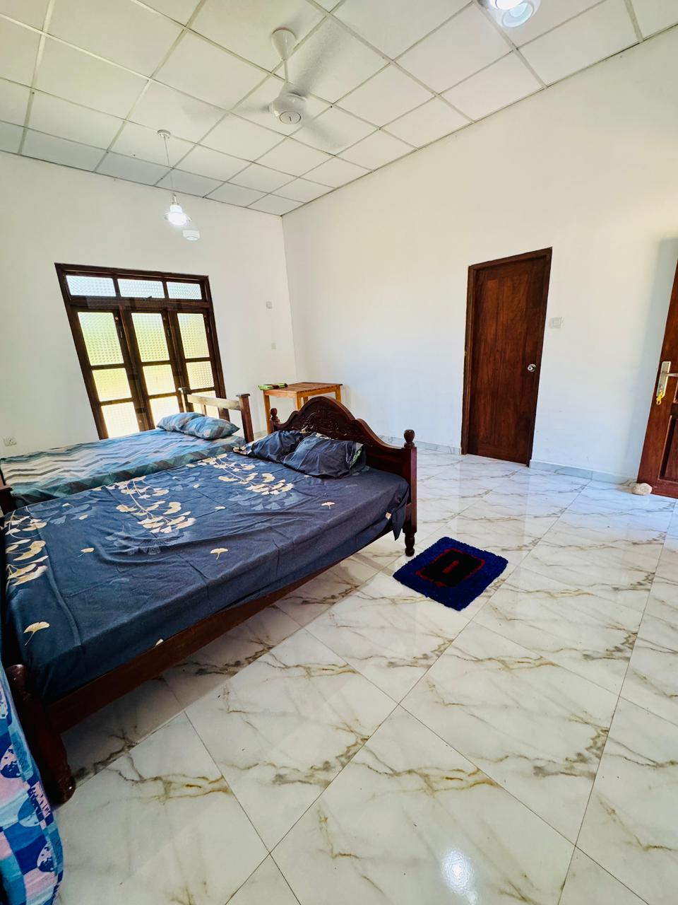

# River side Cottage - Luxury Hotel Booking System



A complete hotel booking website template built with HTML, CSS, JavaScript, PHP, and MySQL. This project provides a fully functional hotel reservation system with an attractive frontend and a secure admin panel.

## 🏨 Project Overview

River side Cottage is a luxury hotel booking website that allows guests to browse rooms, check availability, and make reservations online. The system includes both a customer-facing frontend and an admin backend for managing bookings and room images.

## 🚀 Features

### Frontend Features
- **Responsive Design**: Works on all devices (mobile, tablet, desktop)
- **Room Showcase**: Display of all available room types with images and descriptions
- **Booking System**: Easy-to-use booking interface with date selection
- **Image Gallery**: Beautiful room images and hotel facilities
- **Contact Information**: Clear contact details and location information

### Backend Features
- **Admin Authentication**: Secure login system for administrators
- **Booking Management**: View and manage all hotel bookings
- **User Management**: Track registered users and customers
- **Room Image Management**: Upload and manage room images
- **Database Integration**: Full MySQL database integration

## 🛠️ Technology Stack


## 📁 Project Structure

```
hotel1/
├── admin/                 # Admin panel files
│   ├── index.php          # Admin dashboard
│   ├── login.php          # Admin login page
│   └── manage-images.php  # Room image management
├── css/                   # Stylesheets
├── images/                # All images and media
├── includes/              # PHP includes (database, functions)
├── js/                    # JavaScript files
├── scss/                  # SCSS source files
├── index.html             # Homepage
├── rooms.html             # Room listing page
├── book.php               # Booking processing
├── room-details.php       # Room details page
├── contact.html           # Contact page
└── db_schema.sql          # Database schema
```

## 🎨 Screenshots

### Homepage


### Room Selection


### Booking Form


### Admin Dashboard


## 🔧 Installation

1. **Clone the repository**
   ```bash
   git clone https://github.com/yourusername/hotel1.git
   ```

2. **Database Setup**
   - Create a MySQL database
   - Import the schema from `db_schema.sql`
   - Update database credentials in `includes/db_connect.php`

3. **Web Server Configuration**
   - Place files in your web server directory
   - Ensure PHP and MySQL are installed and running

4. **Admin Access**
   - Navigate to `/admin.php` or `/admin/login.php`
   - Login with:
     - Username: `admin`
     - Password: `*****`

##  rooms

### Deluxe River View Suite
- **Price**: $150.00 per night
- **Features**: King bed, Private balcony, River view, Mini bar, WiFi, TV, Air conditioning
- 

### Garden View Room
- **Price**: $100.00 per night
- **Features**: Queen bed, Garden view, WiFi, TV, Air conditioning, Mini fridge
- 

## 🔐 Admin Panel

The admin panel provides secure access to manage the hotel booking system:

### Login Credentials
- **URL**: `/admin/login.php`
- **Username**: `admin`
     - Password: `*****`

### Admin Features
1. **Booking Management**
   - View all bookings
   - Check booking status (pending, confirmed, cancelled, completed)
   - See customer details

2. **User Management**
   - View all registered users
   - See registration dates and contact information

3. **Image Management**
   - Upload new room images
   - Manage existing room photos
   - Add captions to images

## 📞 Contact Information

- **Address**: Poramadilla, Pelwatta
- **Phone**: 0771313951 (WhatsApp), 0771313951 (normal), 0717999566 (normal)
- **Email**: info@riversidecottage.com

## 📄 License

This project is licensed under the MIT License - see the [LICENSE](LICENSE) file for details.

## 🤝 Support

For support, contact the development team or check the documentation in each file.